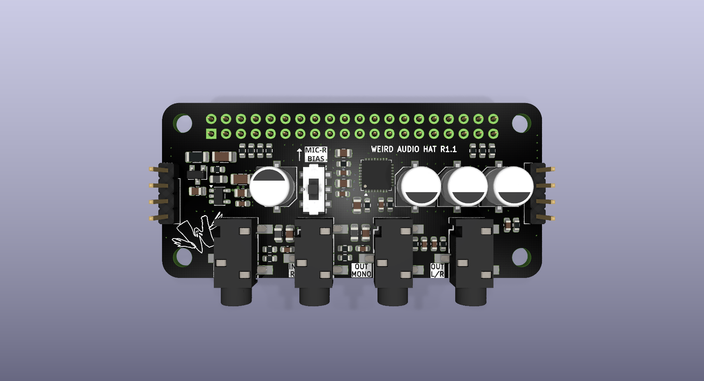

# Weird Audio HAT

A WM8960 sound card for the Raspberry Pi: stereo line in and out, headphone amp, mono out and
a microphone input with bias. It shows up as a normal ALSA sound card.

## Specifications

| | Value | Source |
|---|---|---|
| Codec | WM8960, stereo, 24-bit | rated |
| Sample rates | 44.1 kHz family (master clock 11.2896 MHz) | rated |
| Sample formats | `S16_LE`, `S24_LE`, `S32_LE` — **not** `S24_3LE` | rated |
| Control | I2C, address `0x1A` | rated |
| Frequency response | ±0.5 dB, 100 Hz – 8 kHz | measured |
| Output THD (DAC) | 0.003 % at 1 kHz | measured |
| Crosstalk between inputs | −67 to −92 dB across the band | measured |
| MICBIAS | ~3 V (0.9 × AVDD) | measured |
| Inputs | single-ended, line level | schematic |
| Outputs | stereo line / headphone, mono | schematic |

## Requirements

**Raspberry Pi 1–4 or Zero 2W — not a Pi 5.** The codec has no oscillator; it takes its master
clock from the Pi's GPCLK0, which the Pi 5 does not expose. 48 kHz needs a different clock and
a device-tree change.

## Connectors

| Ref | Type | Carries |
|-----|------|---------|
| J5 | 3.5 mm jack | Line in L (tip) |
| J1 | 3.5 mm jack | Line in R (tip) — MICBIAS when SW1 is on |
| J4 | 3.5 mm stereo jack | Line / headphone out — tip L, ring R \* |
| J2 | 3.5 mm jack | Mono out (tip) |
| J6 | 1×4 header | Line in from a panel — 1 GND · 2 R · 3 GND · 4 L |
| J7 | 1×4 header | Line out to a panel — 1 GND · 2 R · 3 GND · 4 L |
| J3 | 2×20 Pi header | I2C (3, 5) · I2S (12, 35, 38, 40) · GPCLK0 (7) · 3.3 V / 5 V |
| SW1 | slide switch | MICBIAS onto J1 |

\* R1.1: L and R are swapped; the driver's `DAC L/R Swap` control corrects it.

## Using it

Install the driver: [weird-audio-hat-driver](https://github.com/loopea-lab/weird-audio-hat-driver).
It covers recording, playback, routing and gain.

- **Inputs are single-ended** (LINPUT3 / RINPUT3). The codec's differential mode is not wired.
- **Headphone out** is AC-coupled; it drives 32 Ω headphones or a line input.
- **Microphone:** SW1 puts MICBIAS on J1 only. `MIC Bias` must also be enabled in software.

## Troubleshooting

**No sound card in `aplay -l`.** Not on a Pi 5? Driver installed? Do not add
`dtoverlay=wm8960-soundcard` to `config.txt` — the driver's service loads it. `i2cdetect -y 1`
should show `1a`.

**Recording fails or is silent.** Use `S32_LE` (or `S16_LE` / `S24_LE`); `S24_3LE` fails and
looks like dead hardware. If the format is right, the input path is muted — see the driver README.

**No audio from any output.** See known issues below.

## Known issues

**R1.1, first run — outputs shorted to ground.** R6, R22 and R23 shipped as 0 Ω instead of
100 kΩ. Remove them. Check: tip of an output jack to ground reads near 0 Ω while the short is
there. The schematic is corrected, so later runs don't have this.

**R1.1 — output jacks labelled the wrong way round.** Enable the driver's `DAC L/R Swap` control.

## Revisions

| Revision | | Tag |
|---|---|---|
| **R1.1** | SMD, 4 layers — current | `AudioHat-R1.1-production` |
| Rev A | through-hole, first release | `AudioHat-RA` |

The revision is the one printed on the board.

## Combine it with

- [Weird Piano HAT](https://github.com/loopea-lab/weird-piano-hat) — keys and pots, an
  instrument with Pure Data.
- [Weird MCP Inputs](https://github.com/loopea-lab/weird-mcp-inputs) + Control Board + panel —
  a Eurorack module. J6 / J7 carry audio to the panel; the stacking header passes the MCP's
  signals through, so use a good one.

## License

CC BY-SA 4.0 — see [`LICENSE`](LICENSE). Datasheets in `datasheets/` are copyright of their manufacturers.

Copyright © 2024–2026 Weird Electronics / Loopea Lab.
