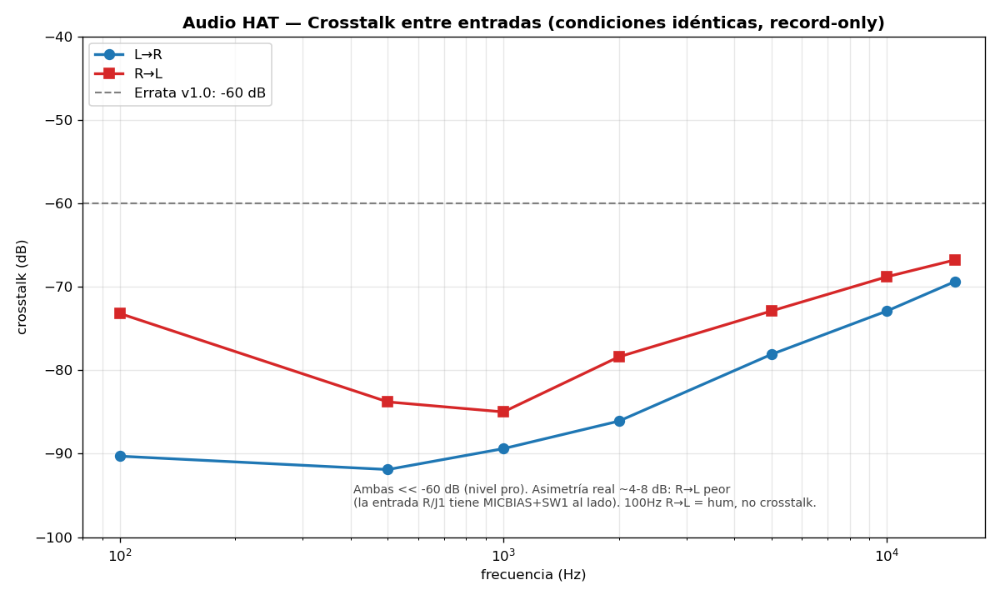

# Weird Audio HAT

Hi-fi stereo audio for your Raspberry Pi — a WM8960 sound card with stereo line in/out, headphone, and
mic. Part of the **Weird** system (pair it with the
[Weird MCP Inputs](https://github.com/loopea-lab/weird-mcp-inputs) for CV + MIDI).


## What it does

- **Stereo line in & out**, **headphone** amp, **mic in** (with MICBIAS)
- Shows up as a normal **ALSA sound card** — record and play like any USB interface
- Hi-fi: flat response (±0.5 dB, 100 Hz–8 kHz), output THD **0.003%**, crosstalk **-67 to -92 dB**



*Crosstalk between inputs: -67 to -92 dB (pro level).*

## What you can do with it

Record a synth, guitar or mixer straight into your Pi; play audio back out to your rack or monitors;
build a Pi-based effects box, looper or sampler. Pair it with the MCP Inputs HAT and your modular can
drive the whole thing.

## Quick start

1. Seat the HAT on the Pi and install the driver (see [weird-audio-hat-driver](https://github.com/loopea-lab/weird-audio-hat-driver)).
2. Confirm it's detected:
   ```bash
   aplay -l        # → card: wm8960soundcard
   ```
3. Record and play back (capture must be **S32_LE**):
   ```bash
   arecord -D hw:wm8960soundcard -f S32_LE -r 44100 -c 2 take.wav
   aplay   -D hw:wm8960soundcard take.wav
   ```

> **Use a Pi Zero 2W or Pi 1–4 — not a Pi 5.** The codec clock comes from the Pi's GPCLK0, which the Pi 5 doesn't have.

## Connectors

| Ref | Type | Carries |
|-----|------|---------|
| J5 | 3.5 mm jack | Line in L (tip) |
| J1 | 3.5 mm jack | Line in R (tip) — MICBIAS when SW1 is on |
| J4 | 3.5 mm stereo jack | Line / headphone out — tip L, ring R \* |
| J2 | 3.5 mm jack | Mono out (tip) |
| J6 | 1×4 header | Line in from the panel — 1 GND · 2 R · 3 GND · 4 L |
| J7 | 1×4 header | Line out to the panel — 1 GND · 2 R · 3 GND · 4 L |
| J3 | 2×20 Pi header | I2C (3, 5) · I2S (12, 35, 38, 40) · GPCLK0 (7) · 3.3 V / 5 V |
| SW1 | slide switch | MICBIAS onto J1 |

\* R1.1: L and R are swapped; the driver's `DAC L/R Swap` control corrects it.

Codec on I2C `0x1A`.

## Documentation

Full manual for the Weird system — assembly, specifications, software and
troubleshooting: **https://github.com/loopea-lab/weird**

This board's page: [Audio Hat](https://github.com/loopea-lab/weird/blob/main/modules/audio-hat.md).

## Revisions

Branches: `main` = R0.1 (legacy) · `dev` = **R0.2** (current).

One thing to know if you have an **R0.2 board from the first run**:

- **Output resistors R6/R22/R23 are populated at 0 Ω** and mute the three outputs. Remove them.
  The schematic ships corrected at 100 kΩ, so later runs don't need this.

## License

CC BY-SA 4.0 — see [`LICENSE`](LICENSE). Datasheets in `datasheets/` are copyright of their manufacturers.

Copyright © 2024–2026 Weird Electronics / Loopea Lab.
